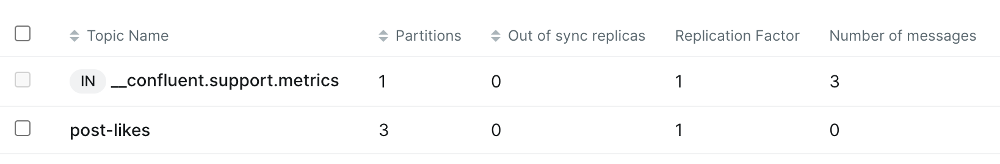

### ルートコンテナの立ち上げ
```sh
$ make up
$ make down #down
```

### コンテナに入る
この作業を`broker-1`, `2`, `3`の各コンテナでも実行する。

```sh
$ docker exec -it broker-1 sh
# $ docker exec -it broker-2 sh
# $ docker exec -it broker-3 sh
# Zookeeperの立ち上げ
/ \# docker compose -f ./src/compose.zookeeper.yml up -d
# Kafkaの立ち上げ
/ \# docker compose -f ./src/compose.kafka.yml up -d
```

### UI 起動用のコンテナに入る
```sh
$ docker exec -it kafka-ui sh
/ \# docker compose -f ./src/compose.ui.yml up -d
```
`localhost:8888`アクセスすると UI が表示される。


# kafka-cliの操作
dockerの中に入る
```sh
$ docker exec -it kafka-cli bash
```

ex)
- Kafkaトピック post-likes を新規作成

- 3つのパーティション
データが3つのパーティションに分かれることで、スループット (処理速度) が向上
パーティションごとに並列処理可能

- レプリケーションファクター 3
データの複製は作成されない
単一ノードに障害が発生するとデータが失われる可能性がある

```sh
$ kafka-topics --bootstrap-server broker-1:9092 --create --topic post-likes --partitions 3 --replication-factor 1
```



### Producerからメッセージの送信
Dockerの中に入る
```sh
$ docker exec -it kafka-cli /bin/bash
```

```sh
--broker-list broker-1:9092 --topic post-likes
>test01
>
```

### Consumerでのメッセージ受け取り設定
dockerの中に入る
```sh
$ docker exec -it kafka-cli /bin/bash
kafka-console-consumer --bootstrap-server broker-1:9092 --topic post-likes --group G1 --from-beginning
test01
```

